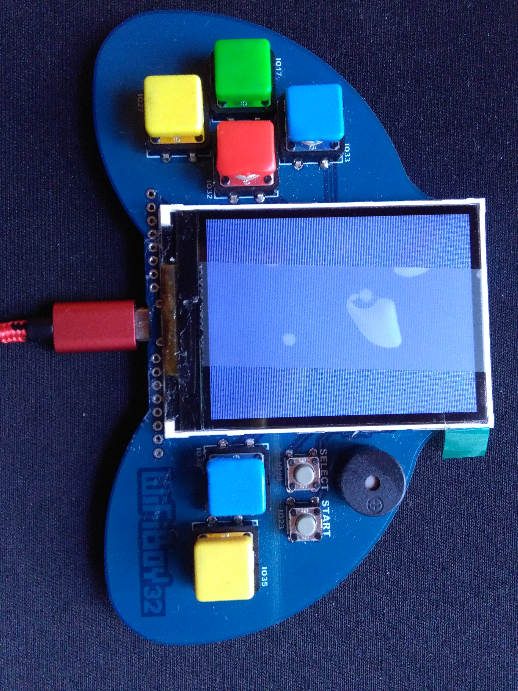

# esp32eforth
esp32eforth is derived from espForth_44 on esp8266 via arduino by Chen-Hanson Ting.
It is for esp32 wifiboy and NodeMCU 12E via arduino IDE by Derek Lai, Albert Lu, Sam Suan Chen, Chen-Hanson Ting.

img_001 esp32 wifiboy front

img_002 esp32 wifiboy back

## arduino IDE
Install arduino IDE first. Create a new sketch.

## ver 1
First derived from espForth_44 by Albert Lu, Sam Suan Chen, Chen-Hanson Ting on 22 sep 2017.
#### Modify esp8266 espForth_44.ino for esp32 wifiboy and NodeMCU 12E as esp32eforth.
    1. ignore WIFI and UDP
    2. ignore tone() since not yet implemented for ESP32.
    3. add input line echoing.
    4. modify COLD at the end to call .OK stead of CR.
    5. modify .OK to print one more space.
#### Try wifiboy led control line by line.
The back slash "\" and the left parenthesis "(" are comment words. All the messages after back slash and between parentheses will be ignored.

	\ to show all defined words, enter the following: 
	words

img_010 show_all_words

    \ to set wifiboy led pin as output direction (led on), enter the following:
    2 ( output ) 10 ( led pin gpio# in hex ) pinSel
    \ set led pin level high to turn off led.
    1 ( high ) decimal 16 ( led pin gpio# in decimal ) pinOut
    \ set led pin level low to turn on led.
    0 ( low ) 16 pinOut
    \ change number base to hexadecimal.
    hex
    \ define led as constant 0x10 (gpio #16).
    10 constant led
    \ define off as constant 0x1.
    1 constant high
    \ define on as constant 0x0.
    0 constant low
    \ define W to wait for a while.
    : wait FFFFF for next ;
    \ define off to turn off led.
    : off high led pinOut wait ;
    \ define on to turn on led.
    : on low led pinOut wait ;
    \ define blinks to blink given number of times.
    : blinks for aft on off then next ;
    \ blink 5 times.
    5 blinks
